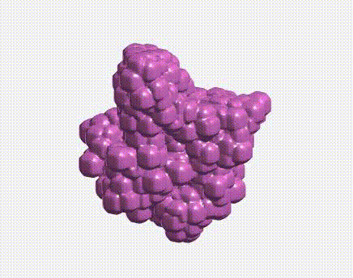
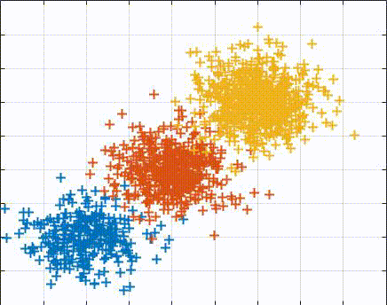

# ConformationClustering
**Clustering conformational states of macromolecules in cryo-em.**

This project aims at developing an method for clustering macromolecules into different conformational states. Since the macromolecules can change their structures during the acquisition process of cryo-em and in some cases, it is not simple to know in priority the number of clusters. The method is based on the hierarchical Hungarian algorithm which does not need to specify the number of clusters.

The left figure illustrates several conformational states of the object and the right figure shows the clustering results on the dataset including three conformational states. Note that the number of clusters is not known in advance.
